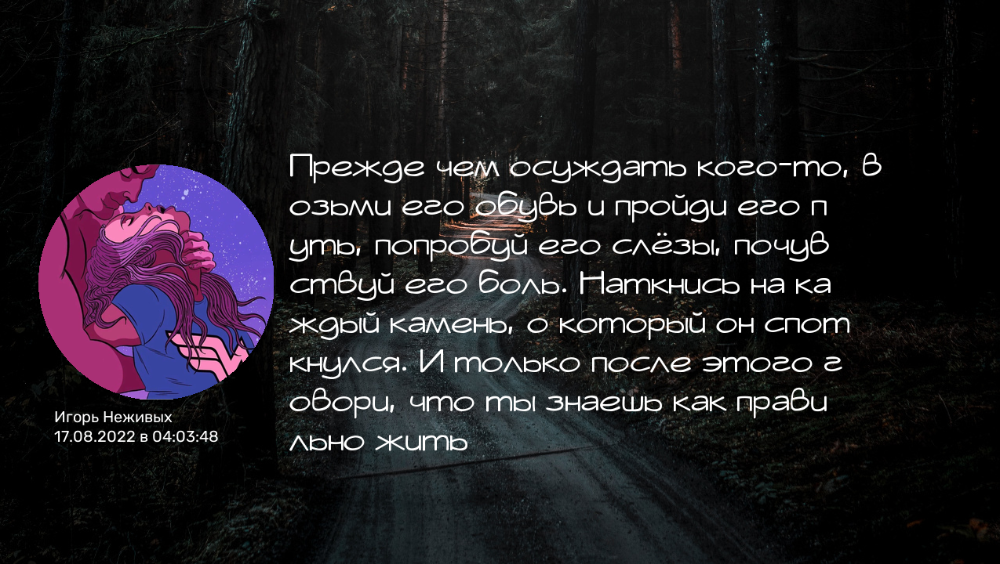

# quote-manager
# Установка: python3 -m pip install quote-manager

**Удобное создание своей цитаты.**

* QuoteManager принимает в себя много параметров, от которых удобно изменять саму цитату.
  К примеру - background_image и avatar_image принимают в себя 3 опциональных объекта
  Это - ссылка на фотографию, путь до фотографии или же - Image от pillow объект.
****
* Если вы НЕ передаёте ссылку в background_image или в avatar_image в функции coroutine_create, то вызывайте обычный синхронный вызов. 


```py
from quote_manager import QuoteManager

avatar_link = "https://.../photo.jpg"

quote_manager = QuoteManager(fullname="Игорь Неживых",
                             text="Прежде чем осуждать кого-то, возьми его обувь и пройди его путь,"
                                  " попробуй его слёзы, почувствуй его боль."
                                  " Наткнись на каждый камень, о который он споткнулся."
                                  " И только после этого говори, что ты знаешь как правильно жить…",
                             path_to_dependencies="default_dependencies",
                             background_image="background.jpg",
                             avatar_image=avatar_link,
                             by_project=None)
```
# На данном фрагменте можно посмотреть аргументы которые попадают в тело класса.

```py
        # Default arguments
        self._path_to_dependencies = path_to_dependencies
        self._fullname = fullname
        self._text = text
        self._date = date
        self._by_project = by_project

        # Optional arguments
        self._background_image = background_image
        self._avatar_image = avatar_image
        self._default_font = default_font
        self._string_line_limit = string_line_limit
        self._string_limit = string_limit

        # Setting sizes options
        self._size_avatar = kwargs.get("size_avatar", (300, 300))
        self._size_background = kwargs.get("size_background", (0, 0, 1280, 720))

        self._coordinates_avatar = kwargs.get("coordinates_avatar", (50, 210))
        self._coordinates_fullname = kwargs.get("coordinates_name", (70, 520))
        self._coordinates_date = kwargs.get("coordinates_date", (70, 545))
        self._coordinates_by_project = kwargs.get("coordinates_by_project", (70, 570))

        # Fonts
        self._fullname_font = kwargs.get("fullname_font", self._default_font)
        self._date_font = kwargs.get("date_font", self._default_font)
        self._main_text_font = kwargs.get('main_text_font', "zero_5.ttf")
        self._by_project_font = kwargs.get("by_project_font", self._default_font)
```
# Возвращаемые методы
****
```py
Возвращается датакласс, в котором происходит реализация контента, который компилирует QuoteManager.
Перейдём к самим методам.

quote_manager = QuoteManager(**params).?

@sync
def get_bytes_io -> io.BytesIO:
    """Не принимает в себя параметры. Возвращает инстанс io.BytesIO(bytes)"""

@sync
def save_image -> None
  """Принимает два параметра: path: str | image_name: str
  path: Путь, куда сохранится изображение
  image_name: Имя фотографии, автоматически заканчивается на .jpg
  image_name опционален, если он не указан, автоматически сгенерируется название по типу quote_[a-z0-9].jpg
  """


@sync
def show_image -> None
    """Не принимает в себя параметры, и генерирует фотографии в ОЗУ, после чего выводит её на экран. Ничего не возвращает"""
    
```
# Результат:
